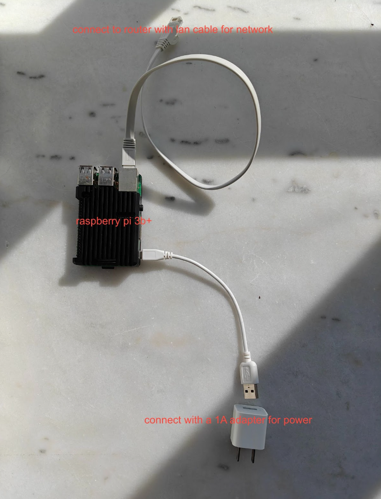
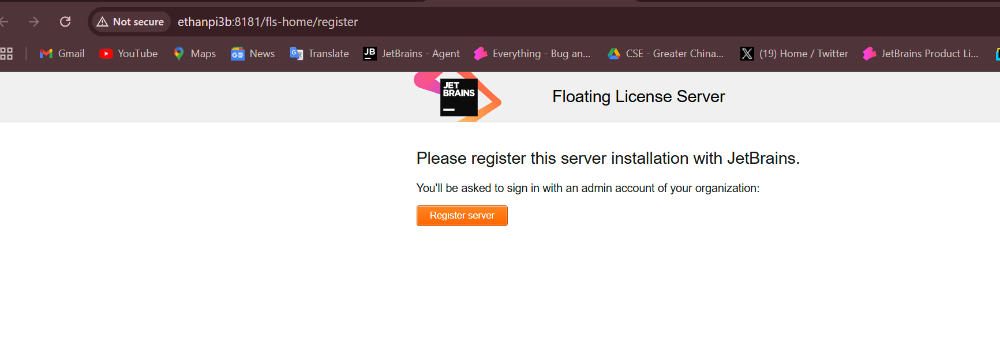
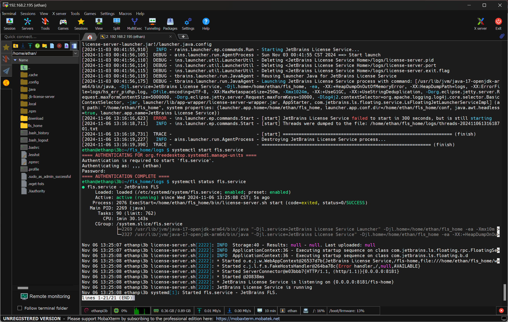

# Edu-Floating-Service

## How it looks





## How to use the small device

1. connect the power cable(usb2.0) to the device
2. plug net cable in
3. wait for about 1 min to let the device to start the service
4. try to access http://ethanpi3b:8181/fls-home/register (if you use Linux or macOS please use http://ethanpi3b.local:8181/fls-home/register 
5. move the licenses for edu purpose via https://account.jetbrains.com
6. try to activate the IDE via Help | Register menu and select license server
7. after finishing using it, just disconnect the power
8. remove the license server from your [JetBrains account](https://account.jetbrains.com) | teams page.

## If it's not started after pluging in the power cable, please try to re-plug in within 10 seconds
## Or access to the device via ssh and start the fls.service manually



# Don't forget to move the licenses out via your account
### 
```shell
rm -rf ./.jb-license-server/
```


### hostname: ethanpi3b
### userName: ethan
### pswd: "jb shanghai office opening day" (it's encrypted:)

## How to restart the service

1. ssh to the device
2. to check the service status, execute command line: `systemctl status fls.service`
3. to restart the service, execute command line: `systemctl restart fls.service`
4. to stop the service, execute command line: `systemctl stop fls.service`

### troubleshooting page: https://www.jetbrains.com/help/license_server/troubleshooting.html

## How to connect it with your wifi?

```shell
sudo raspi-config
```

